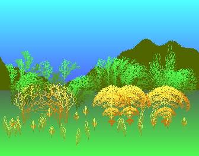



## Mini\-Fractal Painter\(additions\)

### Description

Mini-Fractal Painter by Robert Rayment. (Correction for no drive) (Additions: Faster string-byte handling + DrawWidth) The starting point for this was Loreno Heer's LSystems prog on PSC, where the VB6 Replace function is used to develop the LSys strings. The trees' & plants' size, complexity, color & orientation can be varied. See screen shot which was made in just a few seconds. This prog could easily be extended to include other functions (I've resisted doing that and have only included those necessary to produce a picture like the screenshot) or the methods could be added to an existing VB paint program. VB or ASM can be used to translate the LSys strings and draw to the screen. Win98, Zip 55KB.
 
### More Info
 
2 files in app folder

Just run

Pictures

             |
---                |---
**Submitted On**   |2002-08-01 07:24:20
**By**             |[Robert Rayment](https://github.com/Planet-Source-Code/PSCIndex/blob/master/ByAuthor/robert-rayment.md)
**Level**          |Intermediate
**User Rating**    |5.0 (95 globes from 19 users)
**Compatibility**  |VB 6\.0
**Category**       |[Graphics](https://github.com/Planet-Source-Code/PSCIndex/blob/master/ByCategory/graphics__1-46.md)
**World**          |[Visual Basic](https://github.com/Planet-Source-Code/PSCIndex/blob/master/ByWorld/visual-basic.md)
**Archive File**   |[Mini\-Fract113091812002\.zip](https://github.com/Planet-Source-Code/robert-rayment-mini-fractal-painter-additions__1-36449/archive/master.zip)

### API Declarations

See code

